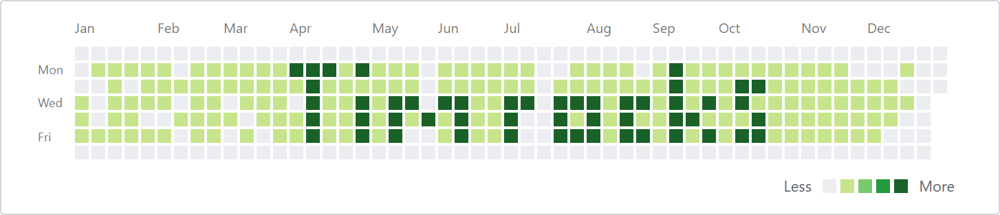

# ActivityPlotter

A fun PowerShell script to plot messages in the activity chart of your github profile :grin:



## Example usage

git init a new repo with a `readme.txt`.  Run something like the following on a daily schedule:

```
Import-Module \path\to\ActivityPlotter.ps1
Invoke-ActivityPlotter '9 April 2017' 'HelloWorld'
```

(NOTE: For PowerShell versions less than 5, remove `-NoNewLine` from the `Add-Content` cmdlet in `Invoke-Activity`.)

## Why bother?

There's no real point, you could probably achieve the same result quicker by modifying the dates of your git commits.  This was just an excuse to noodle with some PowerShell stuff.

## Tests

To run the tests:

```
choco install pester
Invoke-Pester
```
